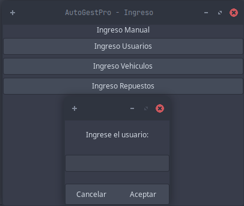
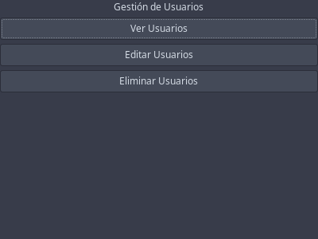
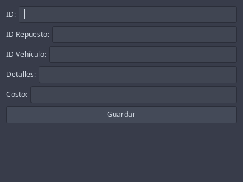

# Manual de Usuario - AutoGestPro

## Introducción
AutoGestPro es un sistema de gestión para talleres mecánicos que permite registrar vehículos, administrar servicios, controlar repuestos y generar facturas de manera eficiente.

## Requisitos del Sistema
- Sistema operativo: Windows o Linux
- Requiere .NET Core y GTK instalados
- Permiso de administrador para la instalación

## Inicio de Sesión
- Usuario: `root@gmail.com`
- Contraseña: `root123`

## Funcionalidades Principales

### 1. Carga Masiva
- Permite cargar datos en formato JSON.
- Se pueden cargar usuarios, vehículos y repuestos.

### 2. Ingreso Manual
- Permite agregar usuarios, vehículos y repuestos manualmente.

### 3. Gestión de Usuarios
- **Ver Usuario:** Mostrar información del usuario y sus vehículos.
- **Editar Usuario:** Modificar nombres, apellidos y correo.
- **Eliminar Usuario:** Eliminar usuario por ID.

### 4. Generación de Servicios
- Crear un servicio asignando un vehículo y repuestos.
- Si un repuesto o vehículo no existe, se mostrará un error.

### 5. Generación de Facturas
- Al crear un servicio, se genera automáticamente una factura.
- La factura se almacena en una pila con ID, ID de orden y total.
- La información se almacena en la matriz bitácora.

### 6. Cancelación de Factura
- Extrae la factura de la pila y muestra sus detalles.

### 7. Reportes Visuales
- Genera diagramas con Graphviz para visualizar las estructuras de datos.
    Estos se pueden visualizar en la carpeta llamada Reports.

