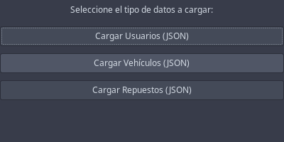
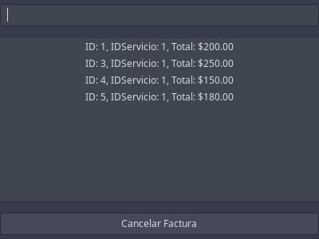

# Manual de Usuario - AutoGestPro

## Introducción
AutoGestPro es un sistema avanzado de gestión para talleres mecánicos que permite el control integral de servicios automotrices, incluyendo gestión de clientes, vehículos, inventario y facturación.

## Requisitos del Sistema
- Sistema operativo: Windows o Linux
- Java Runtime Environment (JRE) 11 o superior
- 2GB RAM mínimo
- Resolución de pantalla: 1366x768 o superior

## Acceso al Sistema
1. Credenciales por defecto:
    - Usuario Root: `admin@autogestion.com`
    - Contraseña Root: `admin123`

## Módulos Para Usuario Root

### 1. Gestión de Clientes
- Registro, modificación y eliminación de clientes
- Búsqueda avanzada por DPI o nombre
- Gestión completa de datos personales
- Historial detallado de servicios

### 2. Control Total de Vehículos
- Gestión completa de vehículos
- Administración de historiales
- Control de estados y asignaciones

### 3. Administración de Inventario
- Control total del inventario
- Gestión de proveedores
- Configuración de alertas
- Ajustes de stock

### 4. Gestión de Servicios
- Control total de órdenes
- Asignación y gestión de personal
- Administración de recursos

### 5. Sistema de Facturación
- Control total del sistema de facturación
- Anulación y modificación de facturas
- Reportes financieros completos

## Módulos Para Usuario Normal

### 1. Gestión Básica de Clientes
- Consulta de información de clientes
- Registro de nuevos clientes
- Actualización de datos básicos

### 2. Registro de Vehículos
- Registro de nuevos vehículos
- Consulta de historiales
- Visualización de estados

### 3. Consulta de Inventario
- Visualización de stock disponible
- Consulta de precios
- Verificación de disponibilidad

### 4. Servicios Básicos
- Creación de órdenes básicas
- Seguimiento de estado
- Registro de servicios

### 5. Facturación Simple
- Generación de facturas
- Consulta de historial
- Visualización de reportes básicos

