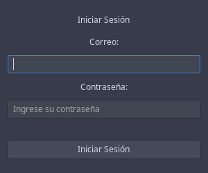
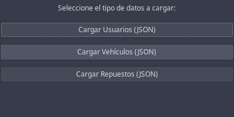
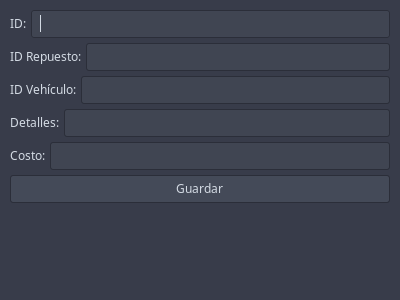
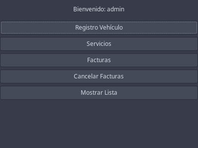
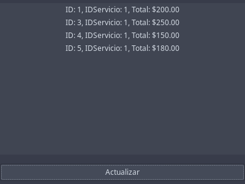
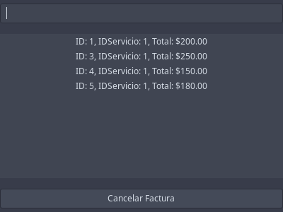

# Manual de Usuario - AutoGestPro

## Introducción
AutoGestPro es un sistema integral de gestión para talleres automotrices que permite controlar clientes, vehículos, inventario, servicios, facturación y seguridad, todo desde una plataforma con interfaz gráfica amigable, diseñada en GTK para entornos Windows y Linux.

## Requisitos del Sistema
- Sistema operativo: Windows 10+ o Linux Ubuntu 20.04+
- Java Runtime Environment (JRE) 11 o superior
- 2GB RAM mínimo (se recomienda 4GB)
- Resolución de pantalla: 1366x768 o superior
- GTK instalado
- Graphviz para reportes visuales

## Acceso al Sistema
1. Ejecutar el archivo `AutoGestPro.jar`.
2. Ingresar credenciales:
   - Usuario Root: `admin@autogestion.com`
   - Contraseña: `admin123`

---

## Módulos del Sistema

### Usuario Root (Administrador)

#### 1. Gestión de Clientes
- Carga masiva y manual de clientes
- Búsqueda por DPI o nombre
- Visualización de historial de servicios

#### 2. Control de Vehículos
- Registro y edición de vehículos
- Estados, historial y relación con cliente

#### 3. Inventario y Proveedores
- Registro de productos
- Asociar proveedores
- Alertas por mínimo de stock

#### 4. Servicios Mecánicos
- Generación de órdenes
- Asignación de mecánico
- Estado de reparación

#### 5. Facturación Avanzada
- Facturación con control de impuestos
- Modificación y anulación de facturas
- Reportes financieros y contables

#### 6. Seguridad y Usuarios
- Gestión de usuarios internos
- Control de accesos y permisos
- Registro de actividad (Blockchain)

---

### Usuario Normal

#### 1. Clientes
- Registro de nuevos clientes
- Consulta de historial personal

#### 2. Vehículos
- Registro de nuevos vehículos
- Visualización del estado actual

#### 3. Inventario
- Consulta de productos y precios

#### 4. Servicios
- Generación de orden simple
- Estado de la reparación

#### 5. Facturación
- Generación y visualización de facturas

